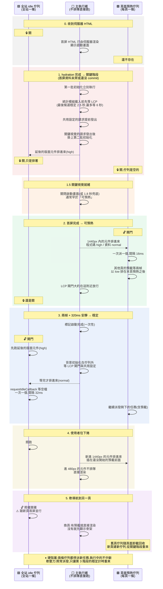

> 首屏畫好之後，頁面其實還有一大串事情要做：預熱視口附近的元件、載入統計與行銷 SDK、掛上延後的版面元件、跑彈窗，還有預載使用者可能點過去的下一頁。問題從來不是「做不做」，而是**什麼時候做、誰先誰後、主執行緒忙的時候誰該停**。這篇記錄一套頁面啟動排程的完整機制，最後把它攤在一條時間軸上 —— 有些問題，只有在時間軸上才看得到。

> [!NOTE]
> 作者說明：這套排程機制由團隊設計，我不是原作者。我負責的是 LCP 閘門的穩定門檻調整（依實測資料把等待窗從 3.5 秒降到 2.5 秒），以及把底部選單頁的預載接進這套佇列；其餘是我在維護過程中整理出的理解。

這篇是上篇，講機制本身。下篇〈[提早預載又不搶首屏](/posts/preload-scheduling-tradeoffs)〉講的是在這套機制上放一個新需求時的取捨。

## 一、先量化「主執行緒有多忙」

所有閘門的判斷都建立在一個問題上：現在派一個新任務，使用者會不會感覺到卡？這需要一個量測，而不是猜。

量測的原始訊號有兩種：

- **掉幀**：用 `requestAnimationFrame` 量兩幀之間的間隔。間隔 ≥ 32ms 記一次「軟掉幀」，≥ 50ms 記一次「硬掉幀」。
- **長任務**：用 `PerformanceObserver` 監聽 `longtask`。

在 1.6 秒的滑動窗內，把這些次數換算成一個 0～100 的空閒分數：

```
空閒分數 = 100 − 軟掉幀 × 3 − 硬掉幀 × 10 − 長任務 × 20
```

再用 EMA（α = 0.35）平滑。平滑是必要的：單一一幀的抖動不該讓閘門開開關關。

從這個分數衍生出兩個等級的旗標：

| 旗標 | 條件 | 意思 |
|---|---|---|
| **硬阻塞** | 最近 320ms 內有 1 個長任務，或 2 次硬掉幀 | 現在派新任務，使用者一定感覺得到 |
| **軟壓力** | 硬阻塞，或空閒分數 ≤ 55 | 還沒穩下來 |

分成兩級不是為了精確，而是因為**它們要拿去做不同的事**。後面會看到：硬阻塞會讓所有佇列停止派發，軟壓力則只影響「什麼時候算穩定」。

## 二、首屏好了沒：四段階梯

第二個問題是：首屏到底好了沒？這裡把它拆成幾個獨立的訊號：頁面是否為目前作用中的頁面、分頁是否可見、版面編排是否完成、首屏資料是否到齊、首屏元件是否已經 commit，以及首屏是否「穩定」。

「穩定」的定義是：首屏完成後，等兩個 `requestAnimationFrame`，再等一個 320ms 的安靜窗，期間沒有出現軟壓力或硬阻塞。

這些訊號組合成四個階段：

| 階段 | 條件 | 意思 |
|---|---|---|
| 背景 | 頁面不是作用中，或分頁被隱藏 | 暫停一切排程 |
| 關鍵 | 編排、資料、commit 任一還沒好 | 首屏關鍵路徑，什麼都別插隊 |
| 可預熱 | 三者都好了，但還沒穩定 | 可以開始預熱視口附近的東西 |
| 穩定 | 三者都好了，而且穩定 | 可以開始全站的背景工作 |

這裡有一個刻意的設計：**階段是每次 render 從訊號重新派生出來的，不是一個狀態機。**

狀態機的風險在於轉移事件。只要漏接一個事件，就會永遠卡在某個狀態，而且這種 bug 很難重現。改成每次從訊號派生，階段就永遠等於「訊號現在的組合」：資料被清掉了，階段自然退回；分頁切回來，階段自然恢復。沒有轉移表要維護，也就沒有轉移可以漏。代價是每次 render 都要算一次，但那只是幾個布林運算。

## 三、兩道閘門

有了「多忙」和「到哪個階段」兩根軸，就能定義兩道閘門：

| 閘門 | 條件 | 性格 |
|---|---|---|
| **預熱閘門** | 不在背景、已離開關鍵階段、沒有硬阻塞 | 早開，只怕硬阻塞 |
| **idle 閘門** | 不在背景、已到穩定階段、沒有軟壓力 | 晚開，有一點壓力就停 |

兩道閘門在兩根軸上都是 idle 比預熱嚴格，所以有一個不變式：

```
idle 閘門放行 ⟹ 預熱閘門一定也放行
```

這個包含關係不是巧合，是刻意設計的。它保證永遠不會出現「背景工作在跑，視口附近的預熱卻被擋住」這種優先順序倒置。

## 四、兩條佇列

閘門決定「能不能跑」，佇列決定「誰先跑」。這裡有兩條，**都是單並發**：

| | 頁面預熱佇列 | 全站 idle 佇列 |
|---|---|---|
| 數量 | 每頁一條，隨頁面卸載一起回收 | 全站一條 |
| 何時開門 | 預熱閘門放行 | 第一次到達穩定之後；之後只看硬阻塞 |
| 派發方式 | `setTimeout(0)`，每次間隔 16ms | `requestIdleCallback`（1.2 秒逾時），每次間隔 32ms |
| 放什麼 | 視口附近元件的程式碼（`high`）、資料（`normal`），以及其他頁的預載（`low`） | 延後掛載的版面元件、SDK、統計、行銷 |

派發方式不同是有原因的。預熱佇列放的是使用者很快就會看到的東西，所以用固定的短間隔穩定推進；idle 佇列放的是真正的背景工作，所以等瀏覽器自己說有空。

「視口附近」用兩個距離來定義：元件距離視口 1440px 以內時，把它的程式碼與資料排進預熱佇列；距離 480px 以內時，不排隊，直接載入並渲染。特別高的元件改用 2400px / 1200px，因為使用者快速往下捲時，它們比較容易先露出空白的佔位高度。

全站 idle 佇列的開門條件值得多說一句：**它是一次性的**。第一次到達穩定之後就永遠開著，之後只有硬阻塞能讓它暫停。這是為了避免每次軟導航換頁，全站的初始化任務都要重新暫停、重新等一次穩定。這個決定有代價，第七節會講到。

## 五、兜底

只要有閘門，就要考慮「永遠等不到」的情況：

- **關鍵視覺 1.8 秒還沒好**：啟動畫面照樣關掉。不讓使用者對著 logo 乾等。
- **首開 4 秒還沒穩定**：強制標記為啟動完成，讓 idle 佇列照樣開門。不讓 SDK 永遠載不到。
- **沒有接上這套機制的一般頁面**：沒有四段階梯可以看，改用簡化版的穩定判斷（雙 `requestAnimationFrame` + 320ms + 沒有硬阻塞）。

## 六、攤在一條時間軸上

前面五節分開看都很合理。把它們放到同一條時間軸上，才看得出彼此怎麼互動。以下是一次首頁首開，從收到伺服器 HTML 到軟導航到另一頁。左右兩條是佇列，中間是不排隊、直接在主執行緒上跑的東西：



LCP 閘門指的是：某些對首屏沒有幫助的模組（例如統計），要等最後一個 LCP 候選穩定 2.5 秒、或最多等 6 秒才載入，避免它們跟 LCP 元素搶頻寬。

## 七、只有在時間軸上才看得到的兩件事

這兩件都不是任何單一模組的 bug。每個模組單獨看都是對的，問題出在模組之間的時序 —— 這正是按模組拆開寫的文件寫不出來的東西。

**一、開門瞬間的競態。** 優先級只能排序**已經在佇列裡**的任務。佇列一開門就會派發，而本頁自己的預熱任務在開門後 5～25ms 才陸續排入（線上實測）。如果其他頁的預載先排了進去，就會被第一次派發直接拿走，插到本頁預熱的前面，拖慢大約 200ms。

現行的做法是讓預載在首屏畫好之後再等兩幀才排入。兩幀是經驗值：在比較慢的裝置上，如果本頁預熱的排入間隔超過兩幀，預載還是會插隊。根本的解法是讓排程器自己提供一個「本頁預熱已經排完」的訊號，預載等這個訊號，而不是等一段固定的時間。

**二、軟導航時，背景工作跟新頁首屏並行。** 因為全站 idle 佇列的開門是一次性的，換到新頁時，它不會像預熱佇列那樣回到「關鍵」重新等待。新頁還在畫首屏的時候，背景的 SDK 任務可能正在執行，能擋住它的只有硬阻塞。這是「不要每次換頁都重新暫停全站初始化」這個決定的代價，是取捨，不是疏忽 —— 但它只有在時間軸上才看得到。

## 小結

1. **先量化「忙不忙」，而且分成兩級。** 硬阻塞決定「能不能派」，軟壓力決定「穩了沒」，兩件事不要混成一個旗標。
2. **階段從訊號派生，不做成狀態機。** 沒有轉移事件，就不會有漏接的轉移。
3. **閘門之間設計成包含關係。** 讓「背景工作在跑、前景預熱被擋」這種倒置在結構上不可能發生。
4. **優先級只管佇列裡面的事。** 任務什麼時候進佇列，仍然是時序問題。
5. **跨模組的問題，要畫在同一條時間軸上才看得到。** 如果你的排程機制分散在好幾份文件裡，值得畫一次。
