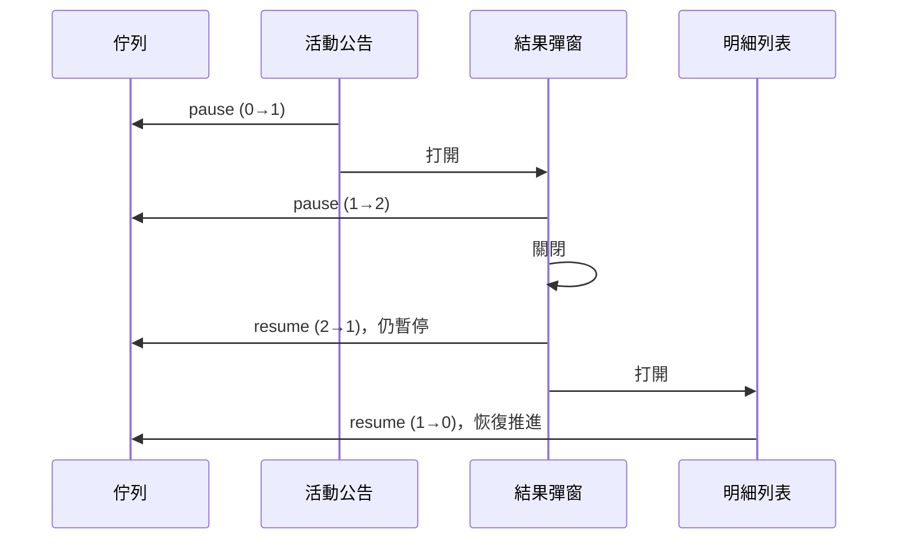

> 這篇記錄我在工作專案裡設計的首頁彈窗佇列：它的核心結構、暫停機制，以及後來踩到的幾種卡死。頁面的軟導航（不整頁重載的站內切頁）是團隊同事建立和維護的既有基礎設施，不是我做的；這裡只談佇列怎麼配合它。

## 多個彈窗同時想出現

首頁一載入，系統公告、活動公告、促銷彈窗、使用者狀態提醒都可能想跳出來，WebSocket 推送的即時通知也隨時會插進來。各自呼叫「打開彈窗」的結果是互相遮擋、順序看運氣，關掉一個發現底下還疊著兩個。

需要的是一個排隊的人：同一時間只讓一個彈窗出現，其他的照順序等。

## 佇列的骨架

設計很保守：

- **單例**：整個應用只有一個佇列物件，所有來源都往同一條線排
- **FIFO 加優先序**：後端回傳時已經按類別分組、組內按排序欄位排好，佇列保持這個順序；少數需要插隊的任務可以指定插到最前或最後
- **只有「關閉」能推進**：佇列執行一個任務後就停下來等，直到有人通知「這個彈窗關了」才取下一個

```ts
// 示意碼
type Task = { key: string; execute: () => void | Promise<void> };

class PopupQueue {
  private queue: Task[] = [];
  private current: Task | null = null;

  start() {
    if (this.current || this.isPaused()) return;
    this.current = this.queue.shift() ?? null;
    this.current?.execute(); // 打開彈窗，關閉時呼叫 notifyClosed
  }

  notifyClosed() {
    this.current = null;
    this.start();
  }
}
```

佇列不知道彈窗長什麼樣，它只持有每個任務的 `execute` 閉包。這讓它跟業務無關，但也埋下伏筆：**推進完全仰賴外部守規矩地呼叫 `notifyClosed`**。後面幾個卡死都跟這條契約有關。

## 軟導航：佇列看不見的換頁

首頁彈窗只該在首頁出現。使用者點進其他頁，佇列要停；回到首頁，要接著跑。

問題在於「換頁」不一定是瀏覽器意義上的換頁。團隊的軟導航層在站內點擊時直接改 `history.state` 並通知 React 換內容樹，不經過框架的 router，也不重新載入。我最早的版本在佇列裡掛了一個 `popstate` 監聽，想在「使用者回到首頁」時恢復佇列。但 `popstate` 只在上一頁、下一頁時觸發，程式呼叫的 `pushState` 不會觸發它，回首頁的那一下佇列根本沒聽到。

所以「何時暫停／恢復」不能自己去聽瀏覽器事件，要訂閱導航層公認的事實。團隊的軟導航提供了一個「目前畫面上可見的路徑」來源（軟切頁過程中，它可能跟網址列短暫不同），同事把佇列的路由控制改成訂閱它：路徑一變，就重新判斷該停還是該跑。

**原則：佇列不要猜導航發生了沒，去問導航層。**

## 暫停用 refcount，而不是布林值

除了換頁，彈窗自己也會要求暫停。典型是一條鏈：活動公告裡點一個按鈕，開出結果彈窗；結果彈窗再點，又開出明細列表。這三個都不是佇列裡的任務，但只要其中一個關掉，就可能觸發推進，讓下一個排隊的彈窗蓋上來。

最初的暫停是布林值 `isPaused`。鏈上每一段都 `pause()`，關閉時 `resume()`。問題是：**第一個 `resume()` 就把所有人的暫停一起解除了**，明細列表還沒打開，佇列已經往前跑。

我把它改成計數：

```ts
pause()  { this.pauseCount++; }
resume() {
  this.pauseCount = Math.max(0, this.pauseCount - 1);
  if (this.pauseCount === 0) this.start();
}
```

每個呼叫者只對自己的那一次暫停負責，計數歸零才真的恢復。這跟可重入鎖、巢狀 transaction 是同一種設計。



改完後彈窗還是卡住。原因很有意思：某個按鈕的點擊處理裡多寫了一次 `pause()`，沒有對應的 `resume()`。布林值時代多 pause 一次結果一樣，看不出來；換成計數後，它讓計數永遠停在 1。我在 `pause` / `resume` 裡印出 `new Error().stack` 的前幾層，跑一次流程，哪個呼叫者不對稱一眼就看到了。

**重構成更精確的狀態，會讓原本被吞掉的錯誤浮出來。這是好事。**

## 幾種不會報錯的卡死

佇列卡住時沒有任何錯誤訊息，畫面就是「該出現的沒出現」。以下四個都是這種。

### 1. 佇列空了，暫停狀態卻沒清

使用者在其他頁登入、再回首頁，首頁彈窗全部不出現。

原本的 `resume` 是這樣寫的：

```ts
if (!this.isPaused || this.queue.length === 0) return; // 佇列空就早退
this.isPaused = false;
```

「要不要清狀態」和「要不要執行任務」被 `||` 綁在同一個早退裡。佇列剛好是空的時候，`isPaused` 沒被清掉；接著首頁拉到新彈窗、登記進佇列，佇列看到自己還在暫停，就不啟動。

另一半原因是我自己留下的不對稱：點擊跳頁前會 `pause()`，原本期待回首頁時由 `popstate` 恢復，而如上所述那個事件不會來。修法分兩層：把清狀態和執行拆成兩個判斷；進入首頁時把計數強制歸零，因為「回到首頁」本來就是安全區。

同一輪還修了一個相鄰的問題：佇列有個「首頁流程已登記過」的旗標，登入狀態切換時清空佇列卻沒清它，舊的 `true` 讓後續邏輯以為首頁已經處理過。修法是讓清空佇列時一併重設，**狀態的重設放在狀態擁有者身上，不要散在各個呼叫端**。

### 2. 幽靈推進

某個即時通知有三個入口：WebSocket 推送、佇列任務、回首頁時的補檢查。程式裡用一個可選參數 `source?: "ws" | "queue"` 區分，沒有內容可顯示時，`if (!isFromWs) notifyClosed()`。

補檢查那條路沒有傳參數，`source` 是 `undefined`，於是被當成佇列任務，呼叫了一次 `notifyClosed`。佇列的槽位明明是另一個活動公告，它被騰空，下一個活動公告打開。兩個活動公告共用同一個彈窗實例，後者直接覆寫了前者的內容，使用者永遠看不到第一個。

修法是把參數改成必填的三態 `"ws" | "queue" | "home"`，推進條件改成 `source === "queue"`。**可選參數加字面量聯合型別會製造隱藏的第三態**，`!isX` 這種二選一判斷會把它併進錯的那一邊。

### 3. 函式開頭多了一行 `return`

正式環境某個排在後面的彈窗永遠不出現，本機正常。佇列裡是「系統公告、活動公告、目標彈窗」，卡在中間那個。

原因是一次樣式調整的提交，在「打開活動公告」的函式開頭夾進了一行 `return;`。它不打開彈窗，也就永遠不會有人呼叫 `notifyClosed`，整條佇列停在這一格。本機為什麼正常？開發環境預設把活動類彈窗過濾掉，那一格根本沒進佇列。

教訓是：**「讓一個彈窗不顯示」和「讓佇列停下」是兩回事**。要停用某個任務，也必須照樣推進佇列。

### 4. fire-and-forget 沒接 catch

有個彈窗打開前要先非同步拉一份資料。佇列當時對任務是「呼叫了就不管」，不 await 也不 catch。請求一失敗，例外往外拋，後面的 `notifyClosed` 跑不到，佇列又停在這一格。

修法是在請求上接住錯誤、視同沒有資料，直接推進而不打開彈窗（避免開了又關的閃爍）。後來同事抽出佇列核心時，也在核心裡把任務的例外視同關閉，從兩邊都堵住。

## 後來的演進

這套佇列之後由同事重構成可獨立測試的核心。路由層的做法也變了：離開首頁不再靠 `pause()`，改成依「頁面資格」決定任務能不能跑，每次路徑變化時把暫停計數歸零。這等於把我那次「回首頁強制歸零」的補丁，提升成每次換頁都適用的系統規則；refcount 則只留給彈窗鏈這種真正需要一對一配對的場景。

## 可以帶走的原則

- **推進信號只有一個，就要保護它**：誰能呼叫、在什麼條件下呼叫，要寫進型別而不是靠慣例
- **多個呼叫者共用的暫停狀態要計數**，並區分「呼叫者自己的釋放」和「系統邊界的強制重設」
- **清狀態和執行動作分開判斷**，別把它們塞進同一個早退條件
- **每個任務的每條路徑都要推進佇列**，包含停用、跳過、例外
- **導航狀態向導航層訂閱**，別自己聽瀏覽器事件去猜
- 卡死不會報錯，所以在暫停與推進的地方印出呼叫堆疊，比在畫面上猜有效得多
