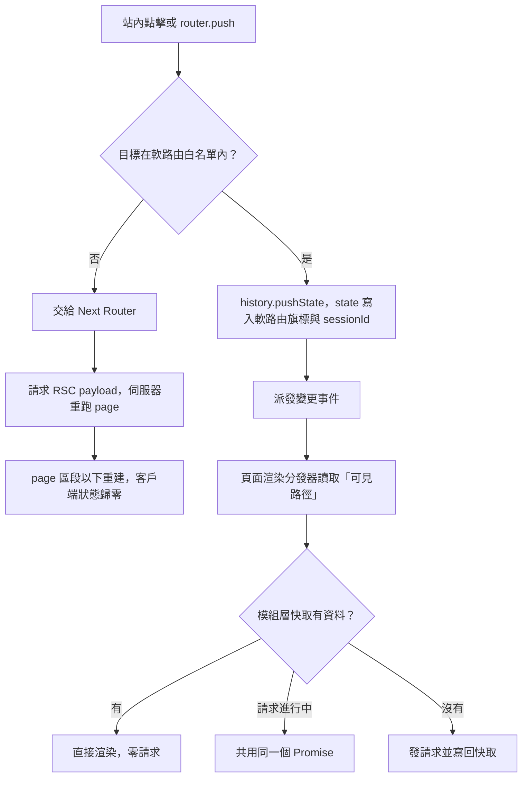
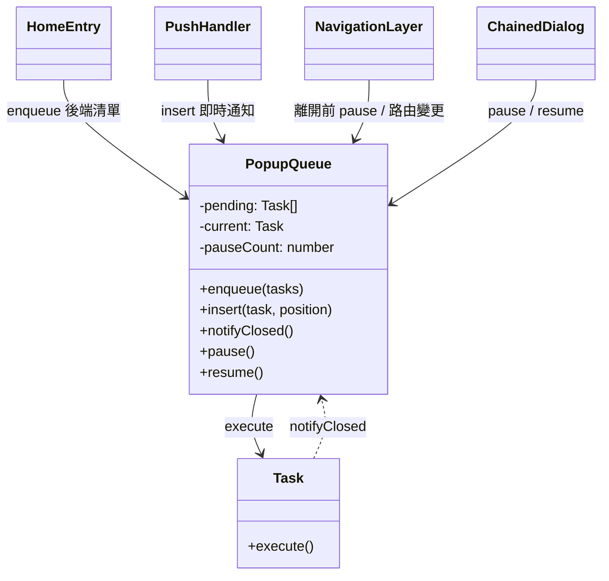

> 這篇記錄兩個彼此咬合的設計。第一個是 Next.js App Router 專案裡的客戶端軟路由，這是團隊的設計，不是我做的；我在它上面做過一些擴充，下面寫的是我對它的理解。第二個是首頁的彈窗佇列。最初的 class 是我設計的，後來同事把核心抽成可以獨立測試的模組。我想講清楚的是兩件事：佇列的職責邊界是怎麼劃的，以及它為什麼一定得知道導航層在做什麼。

## 一、軟路由：問題出在哪

這個站有幾個「重頁面」：首頁、列表頁、個人頁、推廣頁。使用者會在這幾頁之間來回切換很多次。每頁都是後台用元件編排出來的，首屏仰賴 SSR。

App Router 的站內導航（`<Link>` 或 `router.push`）大致會這樣跑：

1. 向伺服器要目標路由的 **RSC payload**，也就是 Server Component 在伺服器端渲染好的序列化結果
2. 伺服器重跑目標的 `page`，順帶把它要的資料也抓一遍
3. 客戶端拿 payload 做 reconcile。共用的 layout 會保留，但 `page` 這個區段整個換掉，底下的 Client Component 全部 unmount 再 mount

第三步才是使用者看得到的問題。每切一次頁，客戶端狀態都歸零：捲動位置、展開的區塊、已經載入的列表全部重來，畫面閃一下，版面也跟著跳。伺服器跑得再快都解決不了，因為根源是**樹被重建**，不是網路慢。

## 二、被否決的方案

**方案 A：留在原生導航，專心優化伺服器端。** 縮短 `page` 的執行時間、用 streaming、縮小元件樹。這個方向前一輪效能改造已經做過，閃爍大概少了一半，但剩下那一半就是 unmount／remount 的成本，伺服器端碰不到。

**方案 B：Parallel Routes 加 Intercepting Routes。** 這是框架原生的解法，和 Suspense、`loading` 整合得最好，日後升級風險也最低。代價是整個路由目錄得重新組織成 slot，而多語系路由前綴和 parallel routes 能不能好好相處，官方文件說得不清楚。團隊評估改動成本太高，沒有深入做 POC。

**方案 C（採用）：自己在客戶端接管站內切換。** 直開、重新整理、爬蟲照舊走 SSR／RSC；只有「已經在站內、再點下一頁」這種情況才由客戶端處理。

## 三、選定的做法



幾個關鍵點：

**包一層導航 API，命中白名單就不呼叫 Next Router。** 專案對外提供的 `push`／`replace` 和 `Link` 都是包裝過的版本，會先判斷目標是不是可以接管的頁面。可以的話只做 `history.pushState`，Next Router 完全不知道這次切換，自然也就不會發 RSC 請求。白名單內的 `Link` 也把 prefetch 關掉了，否則使用者還沒點，頂層 RSC 就先被預取了一輪。

**用 `history.state` 上的旗標分辨「這一筆是誰寫的」。** 每次軟切換都會在 state 寫入：這是軟路由、目標路徑、切換前的底層路徑，以及一個 **sessionId**。sessionId 是 JS 執行環境啟動時產生的隨機值。之所以需要它，是因為瀏覽器重新整理之後通常會保留舊的 `history.state`，光比對路徑會把上一輪留下的 state 誤認成現在的狀態，導致首幀就走錯樹。sessionId 對不上，就當作沒有這筆 state。

**React 端用 `useSyncExternalStore` 訂閱。** 所謂「可見路徑」，是把 `history.state` 和網址列合起來算出的快照。版面最上層有一個頁面渲染分發器，依可見路徑決定要沿用 SSR 帶來的那棵樹，還是改渲染對應頁面的客戶端視圖。

**資料放在模組層快取，加上請求去重。** 頁面設定和資料存在模組層的 `Map`，再用另一個 `Map` 存放進行中的 Promise。同一個 key 同時被要兩次，就共用同一個請求，切回看過的頁面完全不用打 API。

**閒置時預取。** 在 `requestIdleCallback`（後來改成站內統一的閒置任務排程）裡，先把下一個最可能進入的頁面的程式碼和資料抓好。

### 頁面常駐，後來收斂了

最初的設計是所有頁面都掛著，只用 CSS 切換顯示與否，捲動位置、焦點、播放中的影片都能原封不動保留。上線前後很快就收斂成只保留目前這一頁，非首頁的視圖也改成動態載入加骨架畫面。原因寫在決策紀錄的風險清單裡：頁面一直掛著，DOM 會越積越多；看不見的頁面上，effect、訂閱和計時器照樣在跑。

收斂之後，「切頁不閃」主要靠模組層快取撐著：元件還是會重新掛載，但資料已經在手邊，第一幀就能畫出完整內容。這裡的取捨是用一點重新掛載的成本，換掉長期累積的記憶體和背景副作用。

### 代價

最大的代價是「路徑」不再只有一個意思。網址列、Next 內部的路由樹、軟路由的可見路徑、路由彈窗的可見路徑，四者大多數時候相同，但不保證。Next Router 停在舊頁、網址列卻已經換到新頁，這種狀況很常見。所以專案統一提供一組讀路徑的 hook，業務程式碼不能直接用框架原生的版本。另外，SEO meta 不會跟著軟切換更新，快取也不會主動失效。

這個代價接下來會直接影響到彈窗佇列。

## 四、彈窗佇列：它管什麼、不管什麼

首頁進站時，可能同時有系統公告、促銷彈窗、新手引導、即時通知要出現。重構之前，各功能各自開窗，彈窗互相遮擋，優先序也只能靠運氣。

我給佇列劃的邊界是：

- **它管**：順序（下一個輪到誰）、時機（什麼時候可以開下一個）、能不能開（現在在不在允許的頁面、有沒有被暫停）
- **它不管**：彈窗長什麼樣子、資料從哪來、怎麼關閉

所以任務的資料形狀非常薄：

```ts
type Task = {
  execute: () => void | Promise<void>; // 唯一必填：「把彈窗打開」這個動作
  readKey?: number;      // 有值就在打開前回報曝光，給後端做頻率控制
  delaySeconds?: number; // 晚幾秒才進佇列
};
```

公開介面也只有幾個方法：

| 方法 | 職責 |
|---|---|
| `enqueue(tasks)` | 首頁進入時批次註冊後端回傳的彈窗 |
| `insert(task, position)` | 單筆插隊，`first`、`last` 或指定索引 |
| `notifyClosed()` | 目前這個彈窗關了，可以推進下一個 |
| `pause()` / `resume()` | 暫時不准推進 |
| `clear()` | 登入狀態改變時整個清掉，包含還沒到期的延遲計時器 |

### 為什麼只持有 `execute` 閉包

佇列不 import 任何彈窗元件。有的彈窗是原生對話框，有的是 iframe，有的是一次要輪播好幾張的卡片，這些佇列都不需要知道。新增一種彈窗，佇列本身一行都不用改。

閉包還帶來一個附帶好處：同一種彈窗後端一次回好幾筆時，每個任務各自綁住自己那一筆資料。

```ts
// 錯：同類型共用一個 action，N 個任務全都打開第一筆
tasks.push({ execute: actionByType[item.type] });

// 對：每個任務閉包住自己的 item
tasks.push({ execute: () => openNotice(item) });
```

### 推進契約

佇列推進的**唯一訊號**，是呼叫方回報「關了」。

```ts
queue.insert({
  execute: () =>
    dialog.open(NoticeDialog, {
      onAfterClose: notifyClosed, // 這一行就是契約
    }),
});
```

佇列不去猜彈窗什麼時候結束，因為它也猜不到：有的彈窗會自己串出下一個對話框，有的在資料不符時根本不打開。所以契約是：**`execute` 不論走哪條路徑，最後都要剛好回報一次「關了」**，連「條件不符、直接跳過」也算在內。

### 優先序與插隊

一開始佇列會用前端的 `sort` 欄位排序，後來我把前端排序拿掉，改成直接照後端回傳的順序入列。順序其實是營運在後台設定的，兩邊各排一次只會互相打架。前端保留的只有插隊：即時推送進來的通知可以用 `first` 排到下一個，或用 `last` 排到最後。

### 暫停為什麼是計數，不是布林

推進訊號是「有彈窗關了」，問題是不是每個關閉都該算數。假設佇列中的某個彈窗被點了一下，打開另一個對話框，那個對話框又再打開第三個。每一層關閉都會觸發同一個關閉 callback，如果佇列照單全收，下一個排隊的彈窗就會蓋在使用者正在操作的那層上面。

所以每個「我要開一個不屬於佇列的東西」的呼叫方，都要先 `pause()`，用完再 `resume()`。如果暫停只是一個布林值，任何一層 `resume()` 都會把其他層的暫停一起解除。換成計數之後，每個呼叫方只負責抵銷自己那一次，計數歸零才真正放行：

```ts
pause()  { this.pauseCount++; }
resume() { this.pauseCount = Math.max(0, this.pauseCount - 1); this.tryNext(); }
```

計數的風險是有人只 pause 不 resume，佇列就永遠卡住。我的解法是指定一個「安全點」：使用者真的回到首頁時，計數直接歸零。原本這是一個獨立的方法，現在已經併進路由變更的處理裡。

## 五、一個功能要接上佇列，要做哪幾件事

1. **把「打開」包成 `execute`**：閉包住自己的資料，不要共用同類型的 action
2. **在每一條出口回報關閉**：正常關閉、條件不符跳過、出錯，三種都要回報
3. **決定入口**：跟著首頁清單批次進來就用 `enqueue`，即時事件就用 `insert` 並選好位置
4. **如果會在佇列外開對話框**：開之前 `pause()`，關之後 `resume()`，要成對
5. **如果事件發生在別的頁面**：留一個標記，等回到首頁再補彈，不要硬塞進佇列

依這個步驟，各種來源共用的是同一個實例：



幾種來源分別是：

- **後端回傳的彈窗**：進首頁時拉一次清單，轉成任務後批次入列
- **即時推送**：如果首頁佇列還在跑，就插到最後；如果已經跑完，就自己開；如果人不在首頁，就留標記，回首頁再補
- **導航層**：站內點擊和路由彈窗在跳轉之前先 `pause()`。理由很具體：換頁會把畫面上的對話框關掉，這些關閉不能被當成推進訊號
- **串聯對話框**：前面提過的多層對話框，每層各自負責一對 pause／resume

## 六、兩者怎麼銜接

佇列只在首頁放行，所以它得知道「現在在哪一頁」。判斷本身很簡單，讀 `location.pathname` 就好，`pushState` 會同步更新網址。麻煩在於**什麼時候該重新判斷**。

我最早寫的是在建構式裡監聽 `popstate`，回到首頁就恢復。在原生導航的年代這樣夠用，因為換頁時整個首頁會重建，佇列等於自動重來。軟路由上線之後，這兩個前提都不成立了：

- `pushState` **不會**觸發 `popstate`，只有上一頁、下一頁會
- 首頁不再 remount，沒有任何「重新開始」的時機

所以佇列改成訂閱導航層提供的「可見路徑」：路徑一變就重新檢查資格，不在首頁就讓任務留在佇列裡等著。這也是第三節那個代價具體落地的樣子：框架原生的 pathname 在軟切換時可能還停在舊頁，佇列必須讀導航層算出來的那一個。

反過來，導航層對佇列只需要做一件事：**離開之前先 pause**。佇列不需要知道軟路由怎麼實作，導航層也不需要知道佇列裡排了什麼。兩邊靠「可見路徑的變更」和「pause」這兩個點接起來。

## 七、契約為什麼重要：一個例子

最初的 class 呼叫 `execute` 時，既沒有 `await` 也沒有 `catch`。某個彈窗在 `execute` 裡要先抓資料，抓失敗就丟出例外，回報關閉的那行永遠跑不到，整條佇列從此卡在那一格，後面的彈窗全部不見。這種錯誤不會產生錯誤畫面，只會讓東西「沒出現」，非常難發現。

當時我只在那個彈窗的呼叫端補了 `try/catch`。但真正的教訓是：佇列既然把推進權交給呼叫方，就該替呼叫方兜住最壞的情況。這正是後來重構處理的事情之一。

## 八、演進：核心被抽出來之後

後來有個需求，要讓某些通知也能在首頁以外的頁面彈出，還要把即時推送觸發的請求結果合併進佇列。為此同事把核心抽成一個不碰瀏覽器的 class，原本的模組只剩一層外殼，負責把外部能力注入進去：

```ts
new QueueCore({
  page: () => currentPageKind(), // 首頁、沉浸式頁面或其他頁
  blocked: () => systemDialogOpen(),
  reportRead: (task) => api.reportShown(task),
  closed: (remaining) => bus.emit("closed", remaining),
});
```

主要改了這些：

- **相依全部注入**：頁面判斷、曝光回報、事件派發都從外部傳進來，測試不需要 DOM 也不需要 mock 模組
- **「正在顯示」和「等待中」分開存**：新的請求結果合併進來時，不會搶走目前正在顯示的那一個
- **`execute` 改成 `await` 加 `try/catch`**：出錯就當作關閉，自動推進，第七節那種卡死從結構上排除
- **資格改成以任務為單位**：每個任務自己宣告能在哪種頁面出現，不再一律只限首頁
- **加上版本號**：清空佇列時版本號遞增，舊的非同步結果回來時直接丟棄
- **暫停計數只在同一頁內有效**：換頁一律歸零，能不能彈交給頁面資格判斷

職責邊界沒有變：佇列一樣只認得 `execute`，一樣靠關閉訊號推進，一樣用計數暫停。改動的是可測試性，以及非同步情況下的穩健度。

## 九、可以帶走的原則

- **繞過框架之前，先確認痛點在哪一層。** 這裡的問題是樹被重建，所以優化伺服器沒有用
- **自己寫進 `history.state` 的東西要能認出是誰寫的。** 重新整理之後 state 還在，但寫它的那個執行環境已經不在了
- **常駐元件不是免費的。** 很多時候把資料快取好、讓元件重掛載，比讓整棵樹一直活著更划算
- **共用的排程器只持有動作，不認識內容。** 用閉包當介面，新增種類不必改核心
- **推進訊號交給呼叫方，就要替最壞的情況兜底。** 例外、跳過、提早返回，都要回到同一個出口
- **多個呼叫方共享的開關要用計數，並留一個能強制歸零的安全點**
- **元件要知道「在哪一頁」時，去訂閱導航層的可見路徑。** 自訂導航之後，框架原生的 pathname 和使用者實際看到的頁面不一定一致
